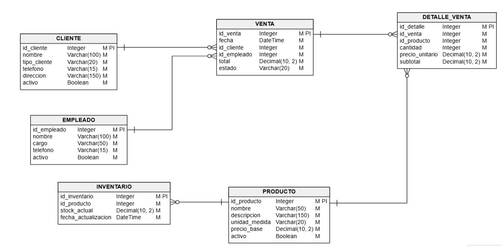
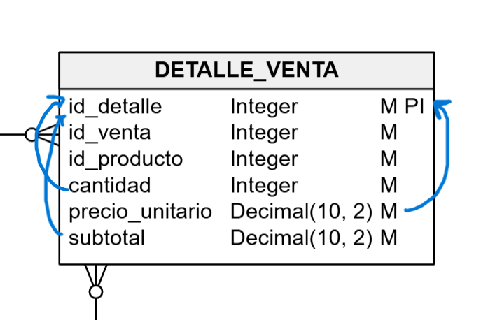
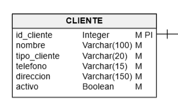

# 📊 Proyecto Base de Datos – ADCAL

## 📌 Descripción

Este proyecto consiste en el diseño e implementación de una base de datos para la empresa **ADCAL**, dedicada a la comercialización de productos agrícolas como leche, papa, camote y maíz, vendidos a acopiadores y mayoristas.

El sistema permite gestionar clientes, productos, ventas e inventario, asegurando la integridad y organización de la información.

---

## 🎯 Objetivos

* Diseñar un modelo de base de datos eficiente.
* Aplicar reglas de normalización (1FN, 2FN y 3FN).
* Implementar la estructura en MySQL.
* Gestionar registros mediante scripts SQL.
* Documentar la base de datos con un diccionario de datos.

---

## 🧩 Modelo de Base de Datos

📷 *Modelo general del sistema:*



El sistema está compuesto por las siguientes tablas:

* **CLIENTE** → Información de acopiadores y mayoristas
* **PRODUCTO** → Productos disponibles
* **INVENTARIO** → Control de stock
* **EMPLEADO** → Personal de ventas
* **VENTA** → Registro de ventas
* **DETALLE_VENTA** → Detalle de productos por venta

---

## 🔗 Relaciones

* Un cliente puede realizar muchas ventas (1:N)
* Un empleado puede realizar muchas ventas (1:N)
* Una venta puede tener varios productos (1:N)
* Un producto puede estar en varias ventas (1:N)

---

## 📚 Normalización

### 🔹 Primera Forma Normal (1FN)


La base de datos cumple con la primera forma normal porque todos los atributos son atómicos, es decir, cada campo contiene un solo valor. Además, todas las tablas cuentan con clave primaria.

---

### 🔹 Segunda Forma Normal (2FN)



Se cumple la segunda forma normal porque todos los atributos dependen completamente de su clave primaria. No existen dependencias parciales.

---

### 🔹 Tercera Forma Normal (3FN)



La base de datos cumple con la tercera forma normal ya que no existen dependencias transitivas. La información se encuentra correctamente separada en diferentes tablas.

---

## 🛠️ Tecnologías Utilizadas

* MySQL
* MySQL Workbench
* Docker
* Git y GitHub

---

## 📁 Estructura del Proyecto

```
/database
   ├── estructura.sql
   ├── datos.sql

/docs
   ├── diccionario_datos.pdf

/image
   ├── modelo_bd.png
   ├── 2fn.png
   ├── 3fn.png
```

---

## ▶️ Ejecución del Proyecto

1. Crear la base de datos:

```sql
CREATE DATABASE dl_ADCAL;
```

2. Ejecutar el script de estructura:

```sql
SOURCE database/estructura.sql;
```

3. Ejecutar el script de datos:

```sql
SOURCE database/datos.sql;
```

---

## 👨‍💻 Autor

* Eloy Francesco Matos Guando
* Josemaria Raymondi Nicolas

---

## 📌 Notas

Este proyecto fue desarrollado con fines académicos para el curso de Base de Datos, aplicando buenas prácticas de diseño y normalización.

